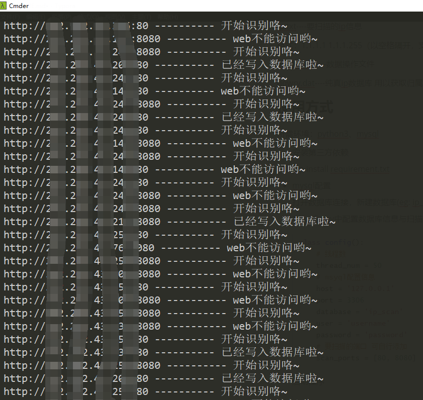
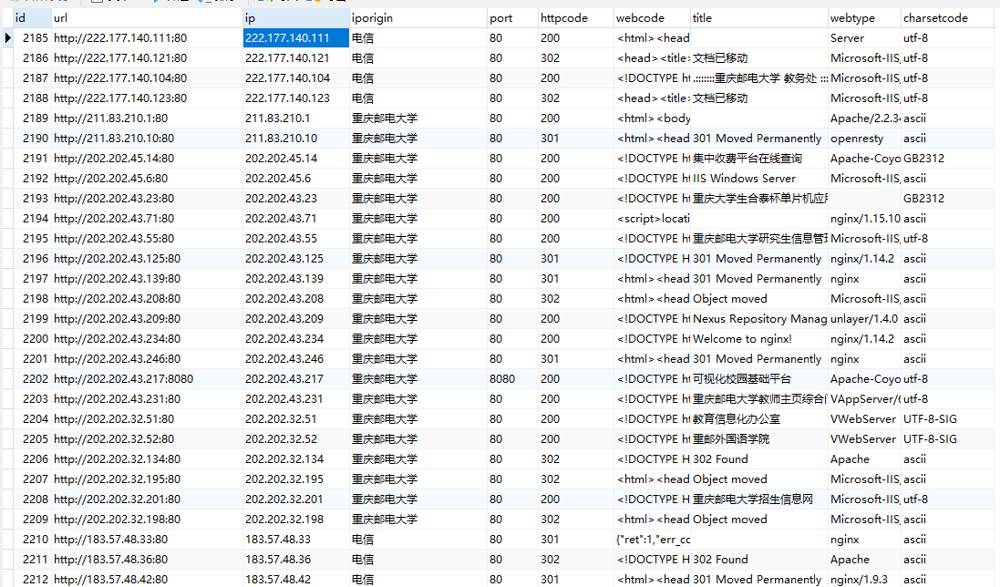

# ipWebScan

# 前言

之前用过一个类似的ip资产收集的工具，但是突然找不到了就写了一个练练手，项目仅供测试使用，请勿用于非法用途！

## 项目文件结构：

config.py----扫描配置信息

ip_scan.py----扫描主程序

ip.txt----要扫描的ip段信息

格式：1.1.1.1 1.1.1.255（以空格隔开，支持多行）  

models.py----数据操作文件

qqwry.dat----纯真ip数据库 用以获取ip归属地

## 使用方式

- 所需环境：

  python3、mysql 

- 安装第三方依赖

  pip install requirement.txt

- mysql配置

  打开数据库连接，新建数据库(eg: ip_scan)，数据表结构由orm自动生成。

  在config.py中配置数据库信息与扫描线程数：

  ```python
  class config():
      # 线程数
      thread_num = 50
      # msyql配置信息
      host = '127.0.0.1'
      port = 3306
      database = 'ip_scan'
      user = 'username'
      password = 'password'
      # 要扫描的端口 可自行添加
      scan_ports = [80, 8080]
  ```

- 启动程序

  ```bash
  python ip_scan.py
  ```

## 运行效果




